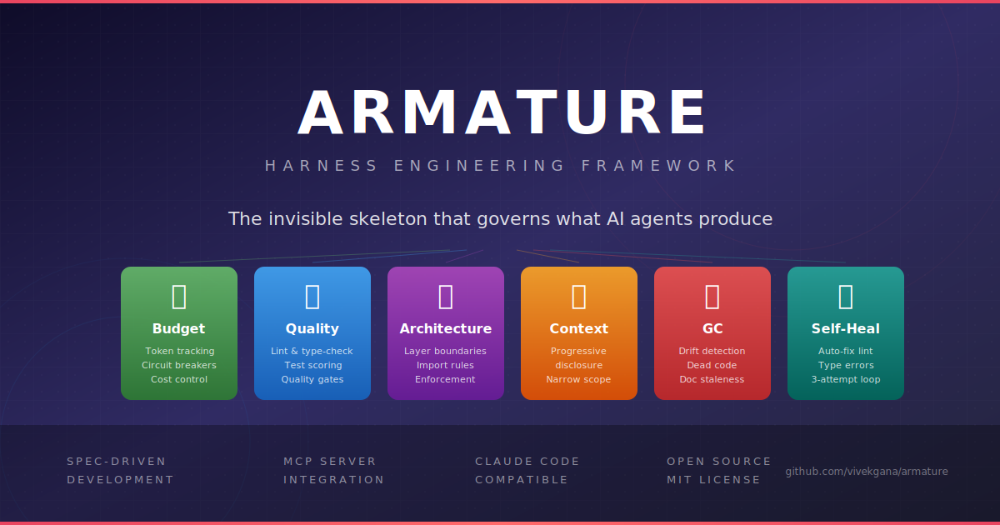
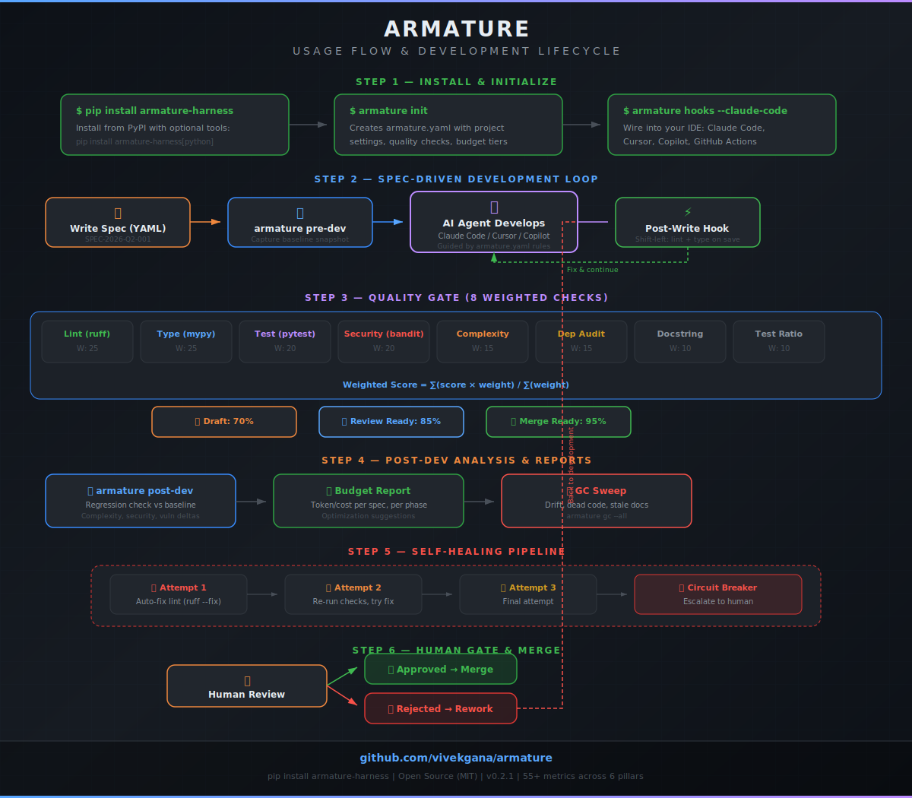

# Armature

<!-- mcp-name: io.github.vivekgana/armature -->

**The invisible skeleton that gives shape to what AI coding agents produce.**

Armature is a harness engineering framework for AI coding agents. It wraps agents (Claude Code, Cursor, Copilot, Windsurf, Aider) in automated guides, sensors, budget controls, architectural enforcement, garbage collection, and self-healing pipelines.

<p align="center">
  
</p>

## System Architecture

<p align="center">
  
</p>

## Usage Flow

<p align="center">
  
</p>

## Quick Start

```bash
pip install armature-harness

# Initialize in your project
cd your-project/
armature init

# Run quality checks
armature check

# Wire into Claude Code
armature hooks --claude-code

# Self-heal lint violations
armature heal --failures lint
```

## The 6 Pillars

| Pillar | What | CLI |
|--------|------|-----|
| **Budget** | Token/cost tracking, multi-provider routing, semantic cache, auto-calibration | `armature budget` |
| **Quality** | 8 weighted checks (lint, type, test, security, complexity, deps, docstring, ratio) | `armature check` |
| **Context** | CLAUDE.md/AGENTS.md generation, progressive disclosure, cross-session memory | `armature hooks` |
| **Architecture** | Layer boundary enforcement, class conformance, schema sync | `armature check` |
| **GC** | Architecture drift, stale docs, dead code, budget audit | `armature gc` |
| **Self-Heal** | Auto-fix lint, report type/test errors, circuit breaker escalation | `armature heal` |

## Quality Checks (v0.2.1)

8 weighted checks with configurable gates:

| Check | Tool | Weight | Type |
|-------|------|--------|------|
| Lint | ruff | 25 | External |
| Type-check | mypy | 25 | External |
| Tests | pytest | 20 | External |
| Security | bandit | 20 | External |
| Complexity | radon | 15 | External |
| Dependency audit | pip-audit | 15 | External |
| Docstring coverage | AST analysis | 10 | Internal |
| Test-to-code ratio | LOC analysis | 10 | Internal |

**Scoring:** `weighted_score = sum(score * weight) / sum(weight)`

**Gates:** Draft (70%) | Review Ready (85%) | Merge Ready (95%)

## Configuration

Everything is configured in `armature.yaml`:

```yaml
project:
  name: "my-project"
  language: python
  src_dir: "src/"

quality:
  enabled: true
  checks:
    lint: { tool: ruff, weight: 25 }
    type_check: { tool: mypy, weight: 25 }
    test: { tool: pytest, weight: 20, coverage_min: 85 }
    security: { tool: bandit, weight: 20 }
    complexity: { kind: internal, weight: 15, threshold: 10.0 }
    dependency_audit: { tool: pip-audit, weight: 15 }
    docstring: { kind: internal, weight: 10 }
    test_ratio: { kind: internal, weight: 10, threshold: 0.5 }
  post_write:
    enabled: true  # shift-left: check on every file write

budget:
  enabled: true
  providers:
    strategy: cost_optimized
    enabled_models: [claude-sonnet, claude-haiku, claude-opus]
  cache: { enabled: true }
  calibration: { enabled: true, auto_calibrate: true }

architecture:
  enabled: true
  layers:
    - { name: models, dirs: ["src/models/"] }
    - { name: services, dirs: ["src/services/"] }
    - { name: routes, dirs: ["src/routes/"] }
  boundaries:
    - { from: models, to: [routes] }

heal:
  enabled: true
  healers:
    lint: { auto_fix: true }

integrations:
  claude_code: { enabled: true }
```

## Implementation Roadmap

| Version | Features | Status |
|---------|----------|--------|
| v0.1.x | Core framework, 3 quality checks (lint, type, test), budget tracking | Shipped |
| v0.2.0 | Budget 2.5x increases, multi-provider routing, semantic cache, calibration | Shipped |
| v0.2.1 | 5 new quality checks, weighted scoring, baseline regression deltas | Shipped |
| v0.2.2 | Architecture diagrams, code deduplication, type error fixes, function refactoring | Shipped |
| v0.3.0 | Cognitive complexity, mutation testing, flaky test detection | Planned |
| v0.4.0 | Change failure rate, agent edit accuracy, cross-project dashboards | Planned |
| v1.0.0 | Stable API, full TypeScript parity, plugin architecture | Planned |

## IDE Integrations

```bash
armature hooks --claude-code      # .claude/settings.local.json
armature hooks --cursor           # .cursor/rules
armature hooks --copilot          # .github/copilot-instructions.md
armature hooks --github-actions   # .github/workflows/armature.yml
armature hooks --pre-commit       # .pre-commit-config.yaml
```

## The Harness Engineering Model

Armature implements the harness engineering 2x2 grid:

|  | Computational (fast, deterministic) | Inferential (LLM-based) |
|---|---|---|
| **Feedforward (guides)** | `armature.yaml` rules, architecture config, type hints | CLAUDE.md rules, spec constraints |
| **Feedback (sensors)** | ruff, mypy, boundary checks, conformance, GC sweeps | LLM code review, eval judges |

## Claude Code Skills

Armature provides slash commands for Claude Code:

- `/armature-check` -- Run quality sensors
- `/armature-heal` -- Self-healing pipeline
- `/armature-gc` -- Garbage collection sweep
- `/armature-budget` -- Cost tracking and reporting

## Budget Control

Track and optimize AI coding costs:

```bash
# Log usage
armature budget --spec SPEC-001 --phase build --tokens 50000 --cost 1.25

# Generate report
armature budget --report SPEC-001
```

Armature analyzes phase distribution, per-request token usage, and suggests
optimizations: batch file reads, narrow context, progressive disclosure.

## References

- [Ossature](https://ossature.dev) -- Spec-driven development with validate/audit/build
- [OpenAI Harness Engineering](https://openai.com/index/harness-engineering/) -- Harness patterns for AI coding agents
- [Martin Fowler's Exploring Gen AI](https://martinfowler.com/articles/exploring-gen-ai.html) -- Bockeler/Fowler harness engineering series

## License

MIT
