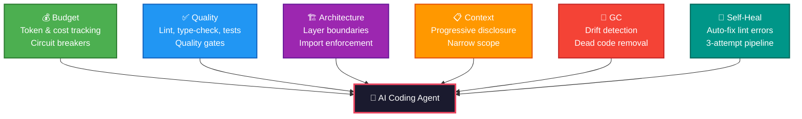
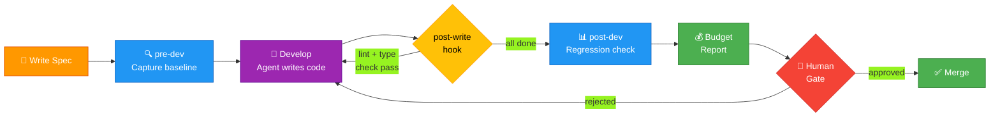
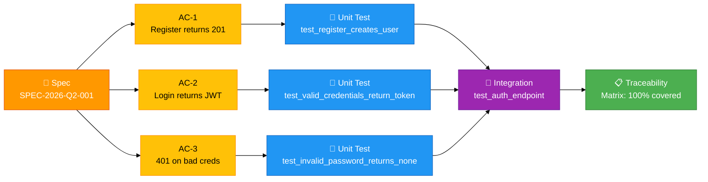

# Introducing Armature: Governance for AI Coding Agents

*April 20, 2026*

AI coding agents generate code fast. But speed without governance is a liability. **Armature** is a harness engineering framework that wraps around your AI coding workflow and adds the controls you need: budget tracking, quality gates, architectural boundary enforcement, and spec-to-test traceability.

---

## Why We Built This

Every team using AI coding agents faces the same questions:

- "How much did that feature cost in API tokens?"
- "Did the generated code actually pass our quality bar?"
- "Is there a human in the loop before this merges?"
- "Can I trace this test back to a specific acceptance criterion?"

Armature answers all of them — automatically, during development, not after.

## The Six Pillars

| Pillar | What It Does |
|--------|-------------|
| **Budget** | Per-spec token/cost tracking with circuit breakers |
| **Quality** | Lint + type-check + test scoring with merge-ready gates |
| **Architecture** | Layer definitions, boundary enforcement, import rules |
| **Context** | Progressive disclosure — agents see only relevant code |
| **GC** | Background agents detect drift, dead code, stale docs |
| **Self-Heal** | Auto-fix pipeline for lint and type errors |



## Spec-Driven Workflow



Every spec is a YAML contract:

```yaml
spec_id: "SPEC-2026-Q2-001"
title: "Add user authentication endpoint"
type: feature

acceptance_criteria:
  - id: AC-1
    description: "POST /auth/register returns 201"
    testable: true

eval:
  unit_test_coverage_min: 90
  integration_test_required: true
```

Armature enforces the `eval` section — if your coverage drops below 90%, the quality gate won't pass.

## Live Demo: Three Example Projects

We shipped complete `output/` folders showing what Armature-governed AI agents produce:

### Python FastAPI
- JWT auth endpoints (register, login, token validation)
- Pagination bugfix with regression tests
- Every function docstring traces back to an AC

### TypeScript Next.js
- Dark mode toggle (CSS custom properties, localStorage, FOUC prevention)
- Composable API middleware (`withAuth`, `withLogging`, `withValidation`)
- Jest tests with spec traceability comments

### Python Monorepo
- Shared auth package for FastAPI + Celery
- GraphQL gateway spike — 3-day investigation → NO-GO recommendation
- Decision doc with architecture diagrams and performance benchmarks

## Comparing Armature vs Ossature

For teams already using Ossature, the compatibility bridge converts and compares:

```bash
armature spec compare-all
```

```
my-fastapi-app vs Spenny       | MEETS=4, GAPS=6
my-nextjs-app  vs math_quest   | MEETS=1, GAPS=5
my-monorepo    vs markman      | MEETS=2, GAPS=4
```

The gaps are where Armature adds value: human gates, spec traceability, quality thresholds, and budget controls that Ossature doesn't provide.



## MCP Integration

Armature is an MCP server — it connects directly to Claude Code, Cursor, or any MCP-compatible agent:

```bash
pip install armature-harness
```

11 tools available: `check_quality`, `get_budget_status`, `check_architecture`, `capture_baseline`, `detect_regressions`, `suggest_optimizations`, and more.

## Get Started

```bash
pip install armature-harness
armature init
# Write your first spec
armature pre-dev SPEC-2026-Q2-001
# ... develop with your AI agent ...
armature post-dev SPEC-2026-Q2-001
```

## Links

- **GitHub:** [github.com/vivekgana/armature](https://github.com/vivekgana/armature)
- **MCP Registry:** `io.github.vivekgana/armature`
- **Spec Guide:** [SPEC_DRIVEN_DEVELOPMENT_GUIDELINES.md](https://github.com/vivekgana/armature/blob/main/docs/SPEC_DRIVEN_DEVELOPMENT_GUIDELINES.md)
- **Spec File Format:** [SPEC_FILE_STRUCTURE.md](https://github.com/vivekgana/armature/blob/main/docs/SPEC_FILE_STRUCTURE.md)

---

*Armature is open source (MIT). Star us on GitHub and tell us what governance features your team needs.*

---

[Back to Blog](./index.html)
