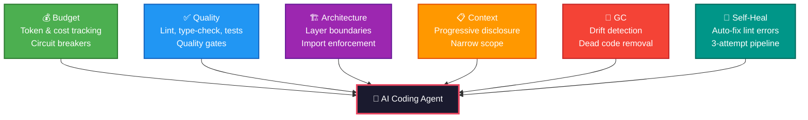
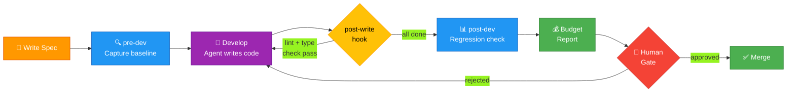
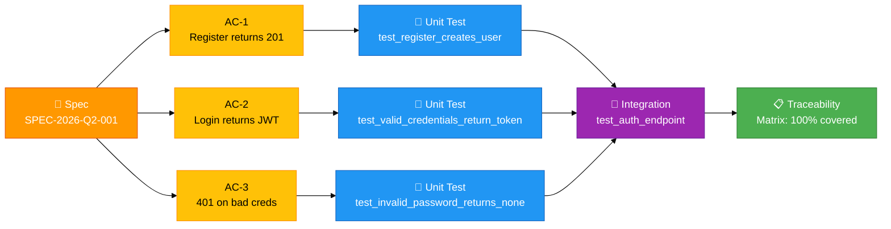

# Armature: The Invisible Skeleton That Gives Shape to What AI Agents Produce


*How we built a harness engineering framework that turns AI coding agents from unpredictable code generators into governed, budget-aware, quality-controlled development partners.*

---

## The Problem Nobody Talks About

AI coding agents are remarkably capable. Give Claude, Copilot, or Cursor a well-scoped task and they'll generate working code in seconds. But here's the uncomfortable truth: **nobody is governing what comes out.**

- How much did that feature cost in tokens?
- Did the generated code pass linting and type checks?
- Does it respect the project's architectural boundaries?
- Is there a human review gate before it gets merged?
- Can you trace every acceptance criterion to a test?

If you can't answer these questions, you're flying blind. And when you're flying blind with a tool that generates hundreds of lines of code per minute, the blast radius of "oops" grows fast.

## Introducing Armature

**Armature** is a harness engineering framework — the invisible skeleton that gives shape to what AI coding agents produce. It wraps around your existing development workflow and adds six pillars of governance:

1. **Budget** — Token and cost tracking per spec, with circuit breakers
2. **Quality** — Automated lint, type-check, and test scoring with quality gates
3. **Architecture** — Layer definitions and boundary enforcement
4. **Context** — Progressive disclosure so agents see only what they need
5. **Garbage Collection** — Background agents that detect drift, dead code, and doc staleness
6. **Self-Heal** — Auto-fix pipeline for common failures (lint, type errors)

Think of it as CI/CD for the AI agent era — but it runs *during* development, not after.



## Spec-Driven Development

At the heart of Armature is a simple idea: **every piece of work starts with a spec.**

```yaml
spec_id: "SPEC-2026-Q2-001"
title: "Add user authentication endpoint"
type: feature
priority: high

acceptance_criteria:
  - id: AC-1
    description: "POST /auth/register creates a new user and returns 201"
    testable: true
  - id: AC-2
    description: "POST /auth/login returns a JWT access token"
    testable: true

eval:
  unit_test_coverage_min: 90
  integration_test_required: true
  linting_must_pass: true
  type_check_must_pass: true
```

This isn't just documentation. It's a **contract** that Armature enforces:



- `armature pre-dev SPEC-2026-Q2-001` captures a quality baseline before work begins
- Every file write triggers `armature check` — lint and type-check run automatically
- `armature post-dev SPEC-2026-Q2-001` detects regressions against the baseline
- Budget tracking logs every token spent against the spec ID
- Traceability ensures every AC has at least one test

## Real Examples, Real Output

We built three complete example projects to demonstrate the full workflow:

### Python FastAPI
Two specs: a JWT authentication feature and a pagination bugfix. Armature generated auth routes, services, models, and regression tests — all traced back to their acceptance criteria:

```python
@router.post("/register", status_code=status.HTTP_201_CREATED)
def register_user(req: RegisterRequest) -> UserResponse:
    """AC-1: POST /auth/register creates a new user and returns 201."""
```

### TypeScript Next.js
A dark mode toggle (with CSS custom properties, localStorage persistence, and FOUC prevention) and an API middleware refactor (composable `withAuth`, `withLogging`, `withValidation`).

### Python Monorepo
A shared auth middleware package consumed by both FastAPI and Celery services, plus a spike investigation into GraphQL gateways — complete with performance benchmarks and a NO-GO recommendation.

### Traceability: From Spec to Test

Every acceptance criterion traces through the full test pyramid:



## The Ossature Bridge

Many teams already use **Ossature** for spec-driven code generation. Armature includes a compatibility bridge:

```bash
# Convert an ossature project to armature format
armature compat convert /path/to/ossature-project --output armature.yaml

# Compare quality governance between the two
armature spec compare --armature examples/python-fastapi \
                      --ossature tests/test_e2e/fixtures/spenny
```

The comparison reveals what Armature adds on top of Ossature:

| Dimension | Armature | Ossature |
|-----------|----------|----------|
| Human gates | 3 enforced | None |
| Quality gate | 95% merge-ready | No threshold |
| Spec traceability | AC-to-test pattern | Not supported |
| Budget tracking | Per-spec JSONL | Not tracked |
| Architecture boundaries | Enforced | Component-level only |

```mermaid
%%{init: {'theme': 'base', 'themeVariables': {'primaryColor': '#4CAF50', 'lineColor': '#333'}}}%%
flowchart LR
    subgraph Armature["🛡️ Armature"]
        direction TB
        A1["💰 Budget Tracking\nPer-spec JSONL + circuit breakers"]
        A2["✅ Quality Gates\n95% merge-ready threshold"]
        A3["🧑 Human Gates\n3 enforced checkpoints"]
        A4["🔗 Traceability\nAC → test docstrings"]
        A5["🏗️ Architecture\nLayer + boundary enforcement"]
        A6["🔧 Self-Heal\nAuto-fix lint + type errors"]
    end

    subgraph Ossature["📦 Ossature"]
        direction TB
        O1["📝 Spec Format\nSMD/AMD files"]
        O2["🔍 Validate\nDeterministic checks"]
        O3["🤖 Audit\nLLM semantic review"]
        O4["🔨 Build\nCode generation"]
        O5["📐 Components\nBasic structure"]
    end

    Ossature -->|"Armature adds\ngovernance layer"| Armature

    style Armature fill:#E8F5E9,stroke:#2E7D32,stroke-width:2px
    style Ossature fill:#E3F2FD,stroke:#1565C0,stroke-width:2px
    style A1 fill:#4CAF50,color:#fff,stroke:#2E7D32
    style A2 fill:#2196F3,color:#fff,stroke:#1565C0
    style A3 fill:#f44336,color:#fff,stroke:#C62828
    style A4 fill:#FF9800,color:#fff,stroke:#E65100
    style A5 fill:#9C27B0,color:#fff,stroke:#6A1B9A
    style A6 fill:#009688,color:#fff,stroke:#00695C
    style O1 fill:#90CAF9,color:#000,stroke:#1565C0
    style O2 fill:#90CAF9,color:#000,stroke:#1565C0
    style O3 fill:#90CAF9,color:#000,stroke:#1565C0
    style O4 fill:#90CAF9,color:#000,stroke:#1565C0
    style O5 fill:#90CAF9,color:#000,stroke:#1565C0
```



## How It Works with Claude Code

Armature ships as an MCP (Model Context Protocol) server, which means it integrates directly with Claude Code:

```json
{
  "mcpServers": {
    "armature": {
      "command": "python",
      "args": ["-m", "armature.mcp.server"]
    }
  }
}
```

Once connected, Claude Code can call 11 armature tools: `check_quality`, `get_budget_status`, `check_architecture`, `capture_baseline`, `detect_regressions`, and more — all without leaving the conversation.

The pre-session hook runs `armature pre-dev --env-check-only` when Claude starts. The post-tool-use hook runs `armature check` after every file write. The agent never sees a stale quality score.

## Budget Control That Actually Works

Every token counts. Armature's budget system tracks usage per spec:

```yaml
budget:
  enabled: true
  defaults:
    low:      { max_tokens: 100000, max_cost_usd: 2.00 }
    medium:   { max_tokens: 500000, max_cost_usd: 10.00 }
    high:     { max_tokens: 1000000, max_cost_usd: 20.00 }
    critical: { max_tokens: 2000000, max_cost_usd: 40.00 }
```

The circuit breaker trips after 3 consecutive over-budget runs. The optimizer suggests narrowing context, batching file reads, or using `/compact` when you're approaching limits.

## Getting Started

```bash
pip install armature
armature init
```

This scaffolds an `armature.yaml` for your project. From there:

1. Write a spec in `specs/SPEC-2026-Q2-001.yaml`
2. Run `armature pre-dev SPEC-2026-Q2-001`
3. Develop with your AI agent (armature monitors every write)
4. Run `armature post-dev SPEC-2026-Q2-001`
5. Check the budget: `armature budget report SPEC-2026-Q2-001`

## The Bigger Picture

AI coding agents are here to stay. But "generate code fast" is table stakes. The teams that win will be the ones that govern their agents with the same rigor they apply to their CI pipelines.

Armature is our answer to that challenge: **make the invisible skeleton visible, and the agent's output becomes trustworthy.**

---

**Links:**
- GitHub: [github.com/vivekgana/armature](https://github.com/vivekgana/armature)
- Docs: [Spec-Driven Development Guidelines](https://github.com/vivekgana/armature/blob/main/docs/SPEC_DRIVEN_DEVELOPMENT_GUIDELINES.md)
- MCP Registry: `io.github.vivekgana/armature`

*Armature is open source under the MIT license. Contributions welcome.*

---

**Tags:** #AI #CodingAgents #DevTools #ClaudeCode #MCP #HarnessEngineering #SpecDriven #OpenSource
